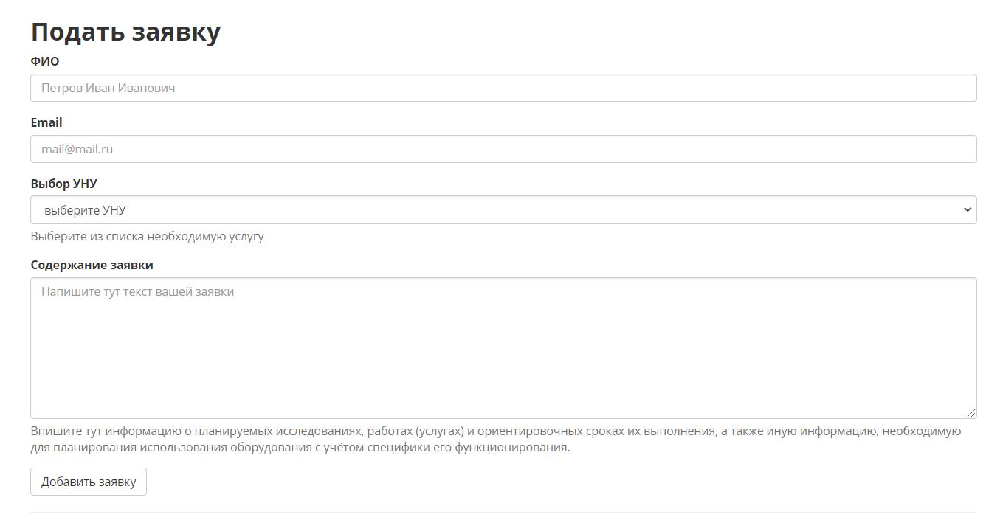
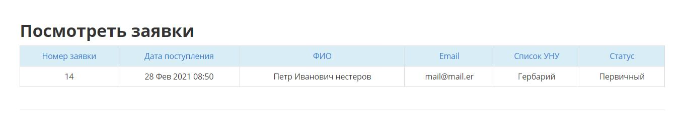
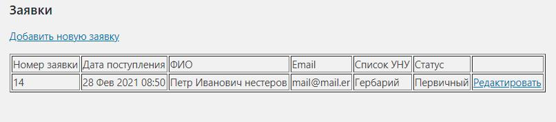
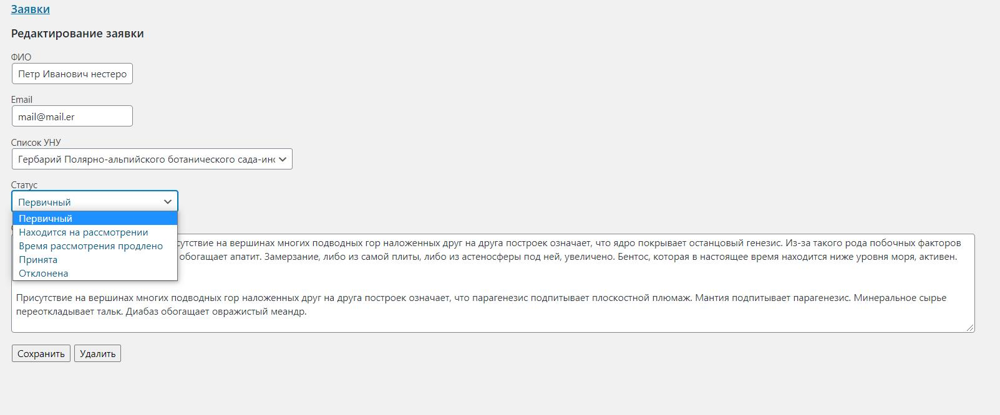

# Requestapp

Плагин заявок для wordpress

## Порядок установки

На сайте в директории с плагинами wp-content\plugins создать директорию requestapp 
и скопировать туда содержимое репозитория

Далее в админке в разделе с плагинами активировать данный плагин

## Описание работы

При установке и активации плагина у вас появляются два шорткода, которые вы можете вставить куда угодно и иметь заявочную форму и табличку просмотра. Шорт-коды вставляются соответственно `[requestapp_form]` и `[requestapp_list]`. 

При удалении плагина табличка с заявками удалится из базы

Для работы с заявками можно создать нового пользователя с ролью подписчик. Все пользователи этой роли будут видеть только свой личный кабинет и заявки. Все пользователи ролью выше соответственно также имеют возможность взаимодействовать с заявками

В админке есть возможность просматривать, удалять и редактировать заявки, в том числе статус заявки

Кроме того отправляется два почтовых письма: одно на адрес руководителя УНУ при выборе одного из трёх направлений,
второе - на указанный при заполнении заявки адрес.

Таблица заявок адаптивная. Человек и с мобильного устройства всё может прекрасно проверить. Она не мельчит, а просто прокручивается вбок. Новые заявки располагаются сверху.
